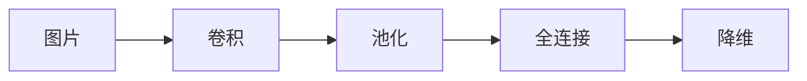

[[算法原理学习01|此篇引用了本文]]
# 工作流

所有CNN都是将一张图片转化为**特征向量**，大致流程是

最终得到一个一维向量，包含图片的**特征**(针对神经网络而言的"特征")

由左到右，就是CNN的**前项传播**过程

## 前向传播：卷积
```ad-tip
用卷积核在原图片的像素矩阵上扫描，对应位置加权相乘，总和作为结果像素矩阵的一个像素点（卷积核覆盖位置称为*感受野*）
- valid padding方式：不补充空白边缘（以卷积核边角作为移动点），size(卷积像素矩阵) < size(原像素矩阵)
- same padding方式：补充空白边缘（以卷积核中心点作为移动点），size(卷积矩阵) = size(原矩阵)
```

当然，对于RGB图像像素空间，卷积核至少有三个（分别对应三个颜色维度的像素值），此时**输入通道**是3维的，卷积核是3阶的，所有通道的结果累加；

## 前向传播：池化（降采样）
```ad-note
池化不改变通道数，会大幅度降低卷积矩阵的size，目的是为了降低数据量，将一个选择框中（以max pooling为例）最大值作为结果的一个像素点（思想：**以点代面**）
```

池化也有stride和padding概念，但通常而言，为简单起见，直接令选择框不重叠地移动即可；
```ad-example
$4\times4$的卷积矩阵，一般就用$2\times2$的选择框移动4次，结果就是$2\times2$大小
```

## 前向传播：全连接

前面反复的卷积+降采样，最终期望得到一个**特征向量**，将这个特征向量传入**全连接层**进行*分类*

全连接层：该层的每个结点都和上一层的所有结点有连接，一个经典的例子就是最基本的*三层神经网络*，其中后面两层都是全连接层，即该三层神经网络就是“全连接网络”

## 前向传播：Dropout（退出）

即网络中每个神经元以p的概率被丢弃，此方法能有效改善过拟合线性

## 反向传播（BP）
当CNN输出结果与期望值**不符时**，则进行反向传播。求出结果与期望值的误差，再将误差一层一层的返回，计算出每一层的误差，然后进行权值更新；