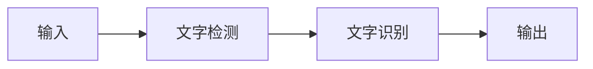

# 知识来源
```ad-info
1. #知乎 [深入学习OCR：数据集合算法](https://zhuanlan.zhihu.com/p/356842725)
2. #知乎 [一文读懂CRNN+CTC文字识别](https://zhuanlan.zhihu.com/p/43534801)
3. #知乎 [场景文字检测—CTPN原理与实现](https://zhuanlan.zhihu.com/p/34757009)
```

# 总体流程

- 文本检测(和**目标检测**类似)：哪里有文字，文字的范围是多少
- 文本识别：对定位好的文本区域进行识别，主要解决每个文字是什么，将图像中的文字区域转化为字符信息

因此文字识别的流程大致是：


# 文字检测

1. [[CNN原理]]
2. [[Faster-RCNN]]
3. 

